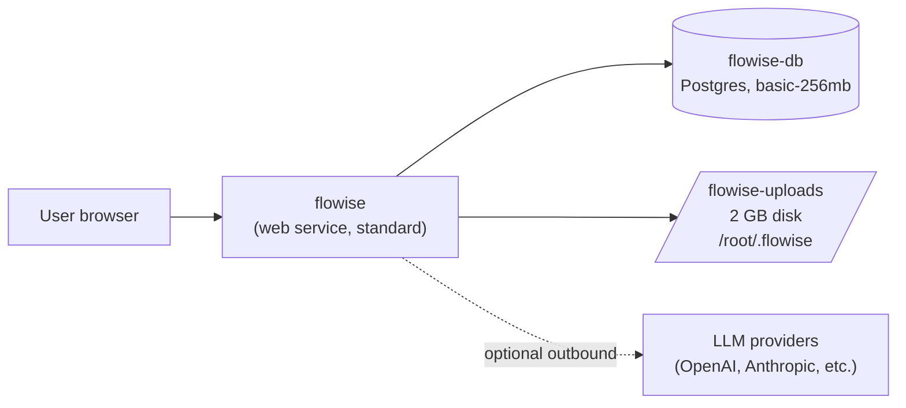

# Flowise on Render (Postgres)

> Self-host Flowise to build LLM agents and workflows visually, with managed Postgres and a clear path to horizontal scaling.

[](https://render.com/deploy-template/api/github/start?template_repo=flowise-render-template-postgres)

This template runs the official `flowiseai/flowise` Docker image on a Render web service backed by managed Postgres, with a small persistent disk only for file uploads and logs. It's production-shaped: Postgres handles the durable state, the disk handles file uploads (until you move them to S3), and every cryptographic secret is generated and persisted by Render so you can drop the disk later and scale horizontally. For a simpler single-user setup, use the [SQLite variant](https://github.com/render-examples/flowise-render-template) instead.


---

## Table of contents

- [Why deploy Flowise on Render with Postgres](#why-deploy-flowise-on-render-with-postgres)
- [Use cases](#use-cases)
- [What gets deployed](#what-gets-deployed)
- [Quickstart](#quickstart)
- [Configuration](#configuration)
- [Cost breakdown](#cost-breakdown)
- [Customization](#customization)
- [Operations](#operations)
- [Upgrading](#upgrading)
- [Troubleshooting](#troubleshooting)
- [FAQ](#faq)
- [Security](#security)
- [Caveats and limitations](#caveats-and-limitations)
- [Credits and license](#credits-and-license)

---

## Why deploy Flowise on Render with Postgres

- **Managed Postgres wired automatically.** No connection string to copy — `DATABASE_HOST`, `DATABASE_PORT`, `DATABASE_NAME`, `DATABASE_USER`, `DATABASE_PASSWORD` all flow in via `fromDatabase` references in `render.yaml`.
- **Daily Postgres backups, point-in-time recovery on paid plans.** Render snapshots the database automatically; you don't run `pg_dump`.
- **All cryptographic secrets generated by Render.** `FLOWISE_SECRETKEY_OVERWRITE`, JWT secrets, session secret, token hash secret — all `generateValue: true`. They persist across deploys without you handling them, and they don't depend on the disk.
- **A real path to horizontal scaling.** Once you move file uploads off the disk to S3, you remove the disk, set `scaling.numInstances: 2+`, and Render gives you zero-downtime deploys.
- **TLS, custom domains, and a `*.onrender.com` URL out of the box.** No reverse proxy to configure.

## Use cases

What people build on this template:

- **Multi-team LLM workflow platform** — Postgres handles concurrent writes from many editors at once
- **Production RAG chatbot** — daily Postgres backups protect chatflow definitions and saved credentials
- **Customer-support copilot in production** — durable storage + scaling headroom for steady traffic
- **Internal Flowise instance for a 20+ person team** — Postgres avoids SQLite's write-serialization ceiling
- **Multi-environment setup** — pair production (this template) with a SQLite preview ([SQLite variant](https://github.com/render-examples/flowise-render-template))

## What gets deployed



| Resource | Type | Plan | Purpose |
|----------|------|------|---------|
| `flowise` | Web service (`runtime: image`) | `standard` (2 GB / 1 CPU) | Runs `docker.io/flowiseai/flowise:latest`, serves the UI and API on `$PORT` |
| `flowise-db` | Managed Postgres | `basic-256mb` | Durable storage for chatflows, credentials (Flowise-encrypted), users, sessions |
| `flowise-uploads` | Persistent disk | 2 GB | File uploads and rolled logs only — removable once you move uploads to S3 |

The `standard` plan is the floor: Flowise's Node process exceeds the `starter` plan's 512 MB during startup and OOMs before binding the port. See [Caveats](#caveats-and-limitations) for the details.

Region defaults to **`oregon`**. The web service, database, and disk must all be in the same region — override `region:` in `render.yaml` if you want a different one.

## Quickstart

1. Click **[Deploy to Render](https://render.com/deploy-template/api/github/start?template_repo=flowise-render-template-postgres)**.
2. Authorize the Render GitHub App if prompted, choose a destination Git account, and let Render fork this template into your account.
3. On the Blueprint Apply screen, confirm the resources (1 web service + 1 Postgres + 1 disk). No secrets to fill in — Render generates them for you.
4. Click **Apply**. The first deploy takes ~30 seconds for Postgres provisioning, then ~90 seconds to pull the image, then ~30 seconds to boot.
5. Once the service shows **Live**, open the `*.onrender.com` URL from the dashboard. Flowise prompts you to create the first admin account directly in the UI.

After your first login, [the Flowise quickstart](https://docs.flowiseai.com/getting-started) walks through building your first chatflow.

## Configuration

Every env var below is set by [`render.yaml`](./render.yaml). You don't need to touch any of them to deploy; tweak only if you have a reason.

### Required secrets

**None.** Flowise creates its first admin user in-app on the initial visit, and every cryptographic secret is generated by Render and persisted as a service env var.

### Auto-generated secrets

Render generates these once on first deploy and stores them as service env vars. You never see or set them. **Do not rotate them later** — rotating breaks every saved credential and invalidates every active session.

| Env var | Purpose |
|---------|---------|
| `FLOWISE_SECRETKEY_OVERWRITE` | Encrypts stored credentials (LLM API keys, DB creds, OAuth tokens) at the application layer |
| `JWT_AUTH_TOKEN_SECRET` | Signs access JWTs |
| `JWT_REFRESH_TOKEN_SECRET` | Signs refresh JWTs |
| `EXPRESS_SESSION_SECRET` | Signs Express session cookies |
| `TOKEN_HASH_SECRET` | Hashes one-time tokens (invites, password resets) |

### Wired automatically

The Postgres connection is wired via `fromDatabase` references — you never type a connection string.

| Env var | Source |
|---------|--------|
| `DATABASE_HOST` | `flowise-db.host` |
| `DATABASE_PORT` | `flowise-db.port` |
| `DATABASE_NAME` | `flowise-db.database` |
| `DATABASE_USER` | `flowise-db.user` |
| `DATABASE_PASSWORD` | `flowise-db.password` |

### Optional tweaks

| Env var | Default | What it does |
|---------|---------|--------------|
| `DATABASE_SSL` | `false` | TLS to Postgres. Off by default because `fromDatabase` wires the **internal** Postgres hostname, which lives on Render's private network and does not require TLS. See [Security](#security) for why we don't use TLS + cert verification here. |
| `LOG_LEVEL` | `info` | Set to `warn` or `error` to quiet noisy logs, `debug` while triaging |
| `NUMBER_OF_PROXIES` | `1` | Number of upstream proxies (Render's edge counts as 1; leave as-is) |
| `TRUST_PROXY` | `true` | Required so Flowise reads `X-Forwarded-*` correctly behind Render's edge |
| `SECURE_COOKIES` | `true` | Set cookies as `Secure`; safe on Render because all traffic is TLS-terminated |
| `DISABLE_FLOWISE_TELEMETRY` | `true` | Disable upstream analytics; flip to `false` to opt in |
| `FLOWISE_FILE_SIZE_LIMIT` | upstream default `50mb` | Cap on file uploads; raise for larger PDFs/CSVs (watch disk fill) |
| `CORS_ORIGINS` | `*` | Restrict the API to specific frontends |
| `IFRAME_ORIGINS` | `*` | Restrict who can embed Flowise via iframe |
| `MODEL_LIST_CONFIG_JSON` | unset | Path to a custom `models.json` to override the built-in model list |
| `DISABLED_NODES` | unset | Comma-separated node names to hide from the editor |

Full upstream config reference: [Flowise Environment Variables](https://docs.flowiseai.com/configuration/environment-variables).

## Cost breakdown

| Resource | Plan | Monthly cost |
|----------|------|--------------|
| `flowise` web service | `standard` (1 CPU, 2 GB) | $25.00 |
| `flowise-db` Postgres | `basic-256mb` (256 MB RAM, 1 GB storage) | $6.00 |
| `flowise-uploads` disk | 2 GB SSD | $0.20 |
| **Total** | | **~$31.20** |

Pricing source: [render.com/pricing](https://render.com/pricing).

**Why standard is the floor**

The `starter` plan (512 MB) is not enough for Flowise — the Node process OOMs during startup before it can bind a port. `standard` (2 GB) is the smallest plan on which Flowise deploys cleanly.

**Scale up**

- Bump the web service to `pro` (2 CPU, 4 GB) for heavy chatflow execution or large RAG ingests.
- Bump Postgres to `basic-1gb` or `pro` when you see CPU/connection-limit pressure.
- Add a [read replica](https://render.com/docs/databases#read-replicas) for read-heavy workloads.
- Move uploads to S3, drop the disk, set `scaling.numInstances: 2+` — see [Scale horizontally](#scale-horizontally).

## Customization

### Pin the upstream version

This template defaults to `flowiseai/flowise:latest`, which is mutable. For predictable deploys, pin to a specific upstream release:

```yaml
# render.yaml
services:
  - type: web
    name: flowise
    runtime: image
    image:
      url: docker.io/flowiseai/flowise:3.1.2   # pick from https://hub.docker.com/r/flowiseai/flowise/tags
```

For maximum reproducibility, pin to a digest:

```yaml
      url: docker.io/flowiseai/flowise@sha256:<digest>
```

### Add a custom domain

1. In the Render dashboard, open the `flowise` service → **Settings** → **Custom Domains** → **Add**.
2. Add a CNAME from your domain to the `*.onrender.com` hostname (or an A/ALIAS record for an apex domain).
3. Render issues TLS automatically once DNS resolves.

If you set a custom domain, also set `APP_URL` to your full HTTPS URL so password-reset emails contain the right links:

```yaml
envVars:
  - key: APP_URL
    value: https://flowise.example.com
```

### Scale horizontally

The disk is what pins this template to one instance. Drop it and you can scale.

1. Provision S3-compatible storage (AWS S3, R2, MinIO).
2. Edit `render.yaml`:
   ```yaml
   services:
     - type: web
       name: flowise
       # remove the disk: block
       scaling:
         minInstances: 2
         maxInstances: 4
         targetCPUPercent: 70
       envVars:
         - key: STORAGE_TYPE
           value: s3
         - key: S3_STORAGE_BUCKET_NAME
           value: my-flowise-uploads
         - key: S3_STORAGE_REGION
           value: us-west-2
         - key: S3_STORAGE_ACCESS_KEY_ID
           sync: false
         - key: S3_STORAGE_SECRET_ACCESS_KEY
           sync: false
   ```
3. Commit, push, fill the two `sync: false` secrets in the dashboard, and redeploy.

Render switches to zero-downtime deploys automatically once the disk is gone.

### Enable queue mode (BullMQ + Redis)

For high-throughput chatflow execution, split workers off into a separate service backed by Render Key Value (Redis). Set `MODE=queue` on the web service, add a `worker` service with the same image and `MODE=queue`, provision a `keyvalue` resource, and wire `REDIS_URL` via `fromService`. This is a larger refactor — see the upstream [Flowise queue mode docs](https://docs.flowiseai.com/configuration/running-flowise-using-queue) and consider it a v2 of this template.

### Add SMTP for password resets and invites

```yaml
envVars:
  - key: SMTP_HOST
    sync: false
  - key: SMTP_PORT
    value: "465"
  - key: SMTP_USER
    sync: false
  - key: SMTP_PASSWORD
    sync: false
  - key: SMTP_SECURE
    value: "true"
  - key: SENDER_EMAIL
    sync: false
```

Without SMTP configured, invite emails and password resets won't be delivered, but in-app account creation still works.

## Operations

### Backups

- **Postgres:** Render automatically snapshots managed Postgres daily. Higher plans add point-in-time recovery. Manage from the database's **Backups** tab. This covers all chatflows, credentials (Flowise-encrypted), users, and sessions.
- **Disk:** Render snapshots the disk on a schedule. This covers in-flight file uploads and rolled logs only.
- **Generated secrets:** Stored in Render's service config, not on Postgres or the disk. Survive redeploys automatically. Cannot be exported.
- **Manual export:** `render psql <db-id>` for ad-hoc SQL access; `render ssh <service-id>` for the filesystem.

### Monitoring

- **Health check:** `render.yaml` sets `healthCheckPath: /api/v1/ping`. A non-200 marks the service unhealthy and Render restarts it.
- **Dashboard metrics:** Service → **Metrics** for CPU, memory, request rate, response time. Database → **Metrics** for connections, CPU, storage, replication lag (if you add a replica).
- **Flowise built-in metrics:** Enable by setting `ENABLE_METRICS=true` (Prometheus exporter on `/api/v1/metrics`).
- **Connection pool watch:** `basic-256mb` Postgres caps at ~100 concurrent connections. Watch the database metrics tab as you scale.

### Scaling

This template starts single-instance because of the disk. Once you've followed [Scale horizontally](#scale-horizontally), Render will:

- Run 2+ instances behind the load balancer
- Perform zero-downtime deploys (rolling instance replacement)
- Auto-scale within your `minInstances`/`maxInstances` bounds based on `targetCPUPercent`

If you scale to 4+ instances, also bump Postgres to `basic-1gb` or `pro` so the connection count and memory don't become the bottleneck.

### Logs

- Dashboard: service → **Logs** for live streaming.
- CLI: `render logs --resources <service-id> --tail`.
- Persisted logs roll to `/root/.flowise/logs` on the disk (configurable via `LOG_PATH`).

## Upgrading

### Pick up upstream releases

- **Easy mode (`latest` tag):** Dashboard → service → **Manual Deploy** → **Deploy latest commit**. Render re-pulls the `latest` tag.
- **Pinned mode (recommended for production):** Edit `image.url` in `render.yaml` to the new version, commit, push. Render auto-deploys on the new tag.

Always snapshot Postgres before bumping across a major version.

### Breaking-change migrations

Notable migrations across Flowise major versions:

- **v3.x → onwards:** auth moved fully in-app; the `FLOWISE_USERNAME` / `FLOWISE_PASSWORD` env vars no longer exist. This template never used them, so no action.
- **Postgres schema changes:** Flowise runs TypeORM migrations on startup. If a migration fails, the service health check will fail. Check logs for the migration error; in extreme cases, restore the Postgres snapshot and downgrade the image tag.
- **Future migrations:** check the upstream [CHANGELOG](https://github.com/FlowiseAI/Flowise/releases) before bumping a major version.

## Troubleshooting

### Deploy fails during image pull

**Symptom:** Deploy event shows `failed to pull image` or hangs on `Pulling docker.io/flowiseai/flowise:latest`.

**Cause:** Docker Hub rate limiting or a transient network issue.

**Fix:** Trigger a manual redeploy after a few minutes. If it persists, pin to a specific version tag (Docker Hub rate-limits anonymous `latest` pulls more aggressively).

### Health check fails after a successful build

**Symptom:** Service shows **Deploy failed** with `Health check failed at /api/v1/ping`.

**Likely causes:**

- Postgres not reachable yet — happens occasionally on the very first deploy when DB provisioning races the web service. Trigger a manual redeploy.
- TypeORM migration failed — check service logs for migration errors. The DB may be in a half-migrated state; restore the latest snapshot and retry.
- `PORT` mismatch — confirm `PORT=3000` is set.

### `Error during Data Source initialization: self-signed certificate` (or `self signed certificate in certificate chain`)

**Symptom:** Service crashes on startup. Logs show:

```
[ERROR]: ❌ [server]: Error during Data Source initialization: self-signed certificate
[ERROR]: Error: Auth secrets not initialized. Call initAuthSecrets() first.
```

Render's port scanner also reports `No open ports detected` because the process exits before binding.

**Cause:** Flowise's TypeORM client (see `packages/server/src/DataSource.ts::getDatabaseSSLFromEnv`) hard-codes strict TLS cert verification when `DATABASE_SSL=true` is set without an accompanying `DATABASE_SSL_KEY_BASE64` CA bundle. `DATABASE_REJECT_UNAUTHORIZED=false` is ignored in that code path. Render's internal Postgres endpoint serves a cert signed by Render's internal CA (not the system trust store), so the handshake fails. The `Auth secrets not initialized` error in the second stack trace is a cascading failure from the failed DB connection.

**Fix:** Set `DATABASE_SSL=false` in `render.yaml`. The template ships with this default. The `fromDatabase` references wire up the internal Postgres hostname, which is on Render's private network and does not require TLS. You should only enable `DATABASE_SSL=true` if you also supply `DATABASE_SSL_KEY_BASE64` with the appropriate CA cert.

### `No open ports detected` + `Reached heap limit Allocation failed - JavaScript heap out of memory`

**Symptom:** Logs show Flowise starting (Data Source / migrations / Identity Manager init lines) followed by GC warnings, a `Reached heap limit Allocation failed` fatal error, and the service exits with status `139`. Render's port scanner gives up because the process keeps dying before binding.

**Cause:** The web service is on the `starter` plan (512 MB), which is too small for Flowise's Node process at startup. Flowise blows through ~250 MB before Identity Manager finishes.

**Fix:** Edit `render.yaml`, set `plan: standard` (2 GB / 1 CPU), commit, push. This template ships with `standard` already; you only hit this if you manually downgraded the plan. NODE_OPTIONS / `--max-old-space-size` tweaks alone are not enough — Flowise genuinely needs more RAM than `starter` provides.

### "too many clients" or connection pool exhausted

**Symptom:** Postgres errors mentioning `too many connections` or `remaining connection slots are reserved`.

**Cause:** `basic-256mb` caps at ~100 connections; concurrent workers or replicas can saturate it.

**Fix:** Bump Postgres to `basic-1gb` or higher. If you've scaled the web service to many instances, also consider a connection pooler (PgBouncer in front of Render Postgres).

### Can't log in / "decryption failed" errors

**Symptom:** UI shows "decryption failed" or saved credentials no longer work.

**Cause:** `FLOWISE_SECRETKEY_OVERWRITE` changed (someone rotated it manually).

**Fix:** Restore the prior value of the env var. If it's truly lost, you'll have to delete the affected credentials in the UI and re-enter them. **Do not rotate `generateValue` secrets after initial deploy.**

### Anything else

- Service logs: dashboard → **Logs** (or `render logs --resources <id> --tail`)
- Database logs: dashboard → database → **Logs**
- Deploy logs: dashboard → **Events** → click the failed deploy
- Template bugs: [open an issue in this repo](https://github.com/render-examples/flowise-render-template-postgres/issues)
- Flowise bugs: [open an issue upstream](https://github.com/FlowiseAI/Flowise/issues)

## FAQ

### Can I run this on Render's free or starter plan?

No. The `starter` plan's 512 MB is below Flowise's minimum startup memory — the Node process OOMs before binding the port. The `free` plan additionally lacks persistent disks and managed Postgres has no free tier. `standard` (2 GB) is the floor for the web service regardless of variant. The cheapest production-shaped Flowise on Render is this template at ~$31.20/mo.

### Why both Postgres and a disk?

Postgres holds chatflows, credentials, users, sessions — everything Flowise needs to persist long-term. The disk holds file uploads (`BLOB_STORAGE_PATH`) and rolled logs (`LOG_PATH`), which Postgres isn't well-suited for. Move uploads to S3 and you can delete the disk entirely; see [Scale horizontally](#scale-horizontally).

### How do I migrate from the SQLite variant?

1. Deploy this template.
2. On the SQLite instance, use Flowise's export tooling to dump chatflows to JSON.
3. Use the Flowise Import UI on this instance to restore.

Test on a non-production environment first.

### Can I bring my own Postgres (Aiven, Supabase, RDS, etc.)?

Yes. Remove the `databases:` block from `render.yaml` and set `DATABASE_HOST` / `DATABASE_PORT` / `DATABASE_NAME` / `DATABASE_USER` / `DATABASE_PASSWORD` as `sync: false` secrets. You lose Render's wiring magic and automatic backups, but the rest of the template works unchanged.

### Will Render auto-redeploy when upstream Flowise releases a new version?

No. The `image: latest` tag is mutable, but Render won't poll it. Either trigger a manual redeploy or set up a [deploy hook](https://render.com/docs/deploy-hooks) called by a GitHub Action that watches upstream releases.

### Does this support Flowise queue mode (BullMQ + Redis)?

Not in this template. See [Customization → Enable queue mode](#enable-queue-mode-bullmq--redis) for a sketch. A dedicated queue-mode variant is a likely future template.

### Can I drop the disk entirely on day one?

Yes, if you don't need file uploads or you're ready to wire S3 from the start. Remove the `disk:` block and the `BLOB_STORAGE_PATH` env var, set `STORAGE_TYPE=s3` and the `S3_*` vars. The trade-off: you set up S3 before your first deploy instead of later.

## Security

- **Encryption at rest:** Render's managed Postgres and persistent disks are encrypted at the storage layer. Flowise additionally encrypts stored credentials at the application layer using `FLOWISE_SECRETKEY_OVERWRITE`.
- **Encryption in transit:** TLS terminates at Render's edge for the `*.onrender.com` hostname and any custom domains. The web service → Postgres connection runs over Render's private network with `DATABASE_SSL=false` — TLS is not required for internal Postgres on Render, and Flowise's TypeORM client hard-codes strict cert verification when `DATABASE_SSL=true` without a CA cert bundle (it ignores `DATABASE_REJECT_UNAUTHORIZED=false` in that path), so enabling TLS without supplying Render's internal CA via `DATABASE_SSL_KEY_BASE64` causes startup to fail with `self-signed certificate`. Outbound calls to LLM providers go over TLS.
- **Network exposure:** The web service is public on port `$PORT`. Postgres is reachable only over Render's private network from the web service — there is no public Postgres endpoint enabled by this template. The disk is local to the web service host.
- **Secret rotation:** Safe to rotate: `LOG_LEVEL`, optional config knobs, SMTP credentials. **Dangerous to rotate**: `FLOWISE_SECRETKEY_OVERWRITE` (breaks saved credentials), `JWT_*_SECRET` / `EXPRESS_SESSION_SECRET` / `TOKEN_HASH_SECRET` (invalidates sessions and invites), `DATABASE_PASSWORD` (Render manages this; do not change manually).
- **Vulnerability reports:**
  - Template bugs → [this repo's issues](https://github.com/render-examples/flowise-render-template-postgres/issues)
  - Flowise application vulnerabilities → [FlowiseAI security policy](https://github.com/FlowiseAI/Flowise/security/policy)

## Caveats and limitations

- **Standard plan is the floor.** Flowise's Node process exceeds the `starter` plan's 512 MB during startup and OOMs before binding the port. The template uses `standard` (2 GB) so it deploys cleanly out of the box. Downgrading to `starter` will fail with `Reached heap limit Allocation failed - JavaScript heap out of memory` and `No open ports detected`.
- **Single instance by default.** The 2 GB upload disk pins this template to one instance and restart-style deploys. Follow [Scale horizontally](#scale-horizontally) to unlock multi-instance + zero-downtime deploys.
- **Image tag drift.** `latest` is mutable; subsequent deploys may behave differently than your first one. Pin a version for production.
- **First image pull is slow.** ~90 seconds on cold caches. Subsequent deploys reuse the cached layer.
- **No automatic upstream upgrades.** Render does not auto-redeploy when the upstream pushes a new image. Use a [deploy hook](https://render.com/docs/deploy-hooks) wired to upstream releases if you want this.
- **Region pinning.** Web service, Postgres, and disk must be in the same region. Pick carefully — moving a Postgres instance across regions requires a backup → restore.
- **Postgres connection ceiling.** `basic-256mb` caps at ~100 connections. Upgrade the plan before scaling the web service past 2 instances of concurrent users.
- **TypeORM migrations run on startup.** A failed migration takes the service down. Snapshot Postgres before bumping the image tag.

## Credits and license

- **Upstream:** [FlowiseAI/Flowise](https://github.com/FlowiseAI/Flowise) — Apache 2.0
- **Render template:** MIT — see [LICENSE](./LICENSE)
- **Template maintainer:** [@render-examples](https://github.com/render-examples)

If this template helped you, give the [upstream repo](https://github.com/FlowiseAI/Flowise) a star.
